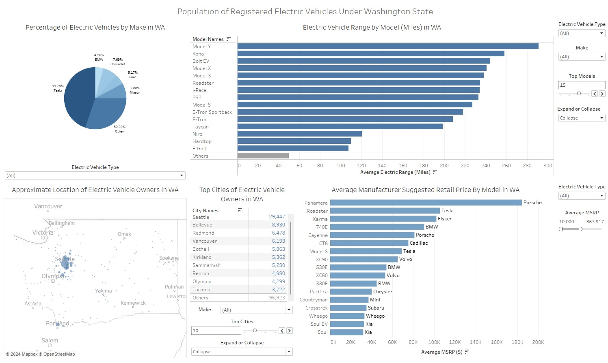
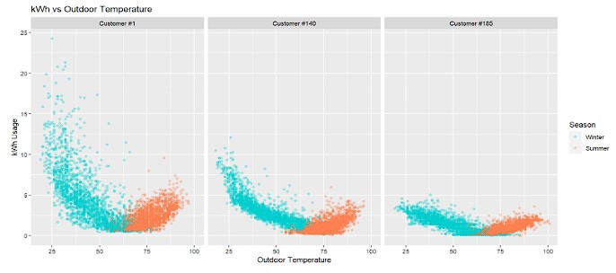
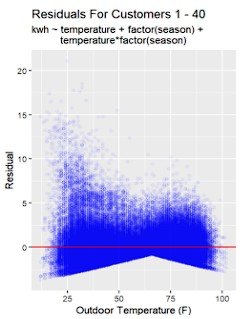
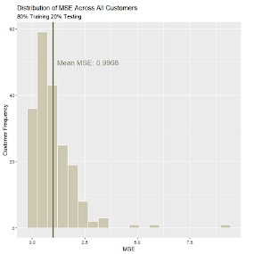
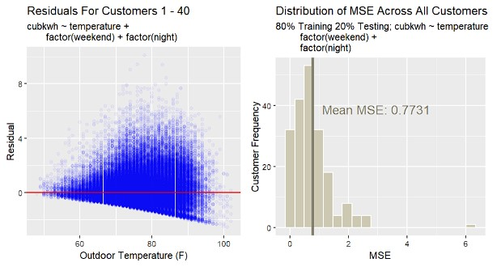

# Portfolio
## Dylan Demo
This portfolio includes a variety of undergraduate, personal, and professional projects.

## [Electric Vehicle Population Analysis (SQL, Tableau)](https://github.com/ddemo829/Electric-Vehicle-Population-Analysis-SQL-Tableau-)
This personal project is an exploratory analysis of Washington state's electric vehicle population. The 2024 dataset comes from Washington state's [Department of Licensing](https://data.wa.gov/Transportation/Electric-Vehicle-Population-Data/f6w7-q2d2/about_data) and includes a variety of columns, such as count of electric vehicles, electric vehicle types, electric vehicle range, and electric vehicle manufacturing retail price. This project involved:

* Utilizing SQL (PostgreSQL) to organize data into related tables to improve query performance and data integrity.
* Cleaning and transforming data using string functions, aggregate functions, and filters.
* Loading and visualizing data in Tableau to display an overview of electric vehicle statistics in WA state.

### Tableau Dashboard of Electric Vehicle Population in Washington State

### Link to [interactive dashboard](https://public.tableau.com/app/profile/dylan.demo/viz/project_17099303425390/Dashboard1)

## [Duke Energy: Statistical Modeling for Customer Energy Usage (R)](https://github.com/ddemo829/Duke-Energy-Statistical-Modeling-R)
My work experience with Duke Energy involved collaborating with my team to develop statistical models for approximately 200 of Duke Energy's customers (~8,600 observations per customer; ~1,700,000 observations total) around the state of North Carolina in order to target inefficient HVAC systems. This project (written in R) involved:

* Modeling hourly customer kWh usage between September 2021 and September 2022 against key explanatory variables such as outdoor temperature and date-time, along with a variety of variable transformations.
* Wrangling customer data to maintain strong data integrity.
* Starting with simple models, then adding more complexity when needed.
* Utilizing for-loops, industry standard train-test splits, and Mean Squared Error (MSE) calculations to determine highest performing models.
* Visualizing model strength through MSE calculations and residual plots using ggplot2 packages.
* A written report and presentation summarizing the key findings to a senior data scientist at Duke Energy.

### Scatter plot of customer kWh usage by outdoor temperature with seasons

### Residual plot and MSE distribution for linear model
 

### Residual plot and MSE distribution for cube root model (summer)

## [Ace Industrial Supply: Data Copying and Formatting Automation (Excel VBA)](https://github.com/ddemo829/Ace-Industrial-Supply-Data-Automation-VBA)
My work experience with Ace Industrial Supply involved programming Excel macros in VBA in order to efficiently copy and reformat data into a readable format for databases. This project involved:

* Seeking a consistent structure of messy data to brainstorm potential areas for automation.
* Writing versatile code that accounts for a variety of inconsistent formats and structures.
* Testing out smaller, less complex macros to ensure copy and formatting accuracy of messy data before final implementation.
* Delivering exported data to supervisor.

### Messy data → formatted clean data

  
 

  

### Link to [screen recording of macro](https://youtu.be/yYXebG6os84)

## [The Effects of Visual and Auditory Cues on Human Reaction Time (SAS)](https://github.com/ddemo829/The-Effects-of-Visual-and-Auditory-Cues-on-Human-Reaction-Time-SAS)
The goal of this undergraduate project for my team and I was to showcase our understanding of Analysis of Variance (ANOVA), contrasts, confidence intervals, and experimental design. This project (written in SAS) involved:

* Handwriting and interpreting a "decomposition diagram" to visualize segments of variation among blocks, factor levels, and residuals. We then referenced the ANOVA table in SAS's proc glm to verify our calculations.
* Interpreting ANOVA F statistic, family wise confidence intervals, and contrasts.
* In a presentation, explaining the complexities of experimental design to a non-technical audience.

### Decomposition of variance and ANOVA table results

  
 

  

